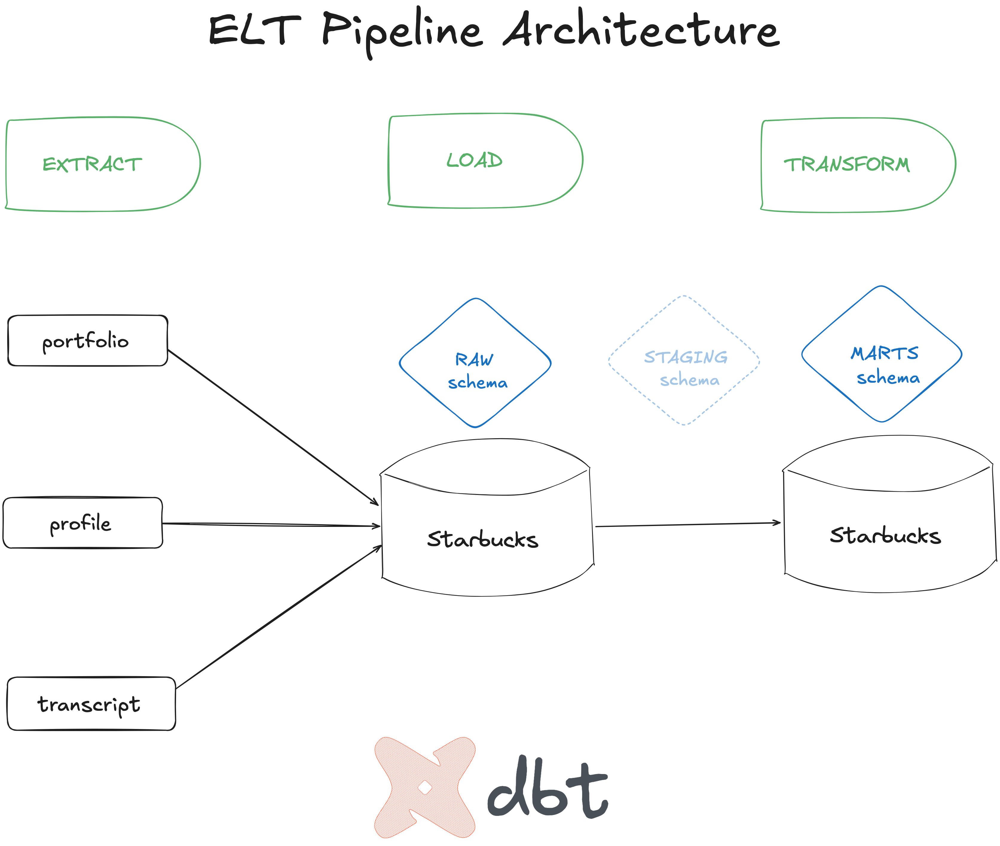
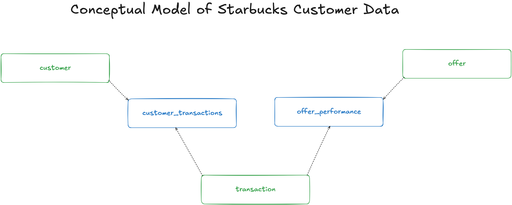
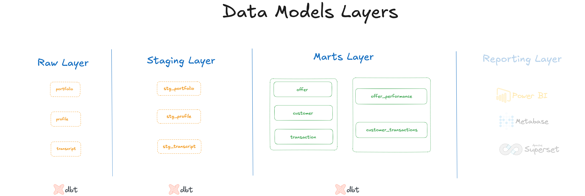

# Starbucks Customer Data

This dbt project is part of the Analytics Engineering Module from Data Engineering Course of
[EDIT](https://weareedit.io/formacao/data-engineering/) academy.

It uses data from Starbucks Customer provided by [Kaggle](https://www.kaggle.com/datasets/ihormuliar/starbucks-customer-data/).

## ELT (Extract, Load, Transform)
For learning purposes and for simplifying the workflow, we'll be using one PostgreSQL database, provided by the Docker compose. In this database, we'll take advantage of [Schemas](https://www.postgresql.org/docs/current/ddl-schemas.html) to separate the three steps of the pipeline.

The following image shows the three main steps we'll take to build our analytics pipeline:

The pipeline contains the following steps:
1. **Extract:** data is collected from Kaggle (stored on `/seeds` folder).
2. **Load:** raw data is directly loaded into the `raw` schema as a [dbt seed](https://docs.getdbt.com/docs/build/seeds).
3. **Transform:** transformations applied on raw data and loaded on, first in `staging` and, then in `marts` schema. In `staging` schema, the models are cleaned and transformed according our needs. Then, in `marts` schema, the data is organised to represent business-defined entities.

## Business-driven questions

Starbucks provided these datasets to simulate how the customers interact with a specific promotional
deal.

Potential business questions:

1. **What types of customers are more likely to respond to promotional offers?**
2. **Which promotional offers drive the highest engagement and lead to customer transactions?**
3. **How do different communication channels (email, mobile, etc.) impact offer response rates?**
4. and so more.

## Conceptual Model

The following image shows the conceptual model of the Starbucks Customer data. Each box represents a business's entity on the Starbucks's business processes. The
business process events represented on the three datasets provided are: **transaction** and **promotional offer**.

Entities which provide context to the **business process event**: (*who*, *what*, *where*, *why*, *how*):
- **customer**
- **transaction**
- **offer**

Entites which aggregate the context and measures of a **business process event**:
- **customer_transactions**
- **offer_transactions**

## Data Models Layers
The following diagram shows how it will look like our final data models, splited in different layers:
- **raw**
- **staging**
- **marts**

